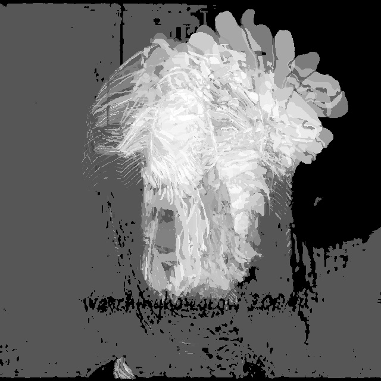

# Computer Vision

## Purpose

Project coded in Python that implements Human Action Recognition that converts a video into a Motion History Image (MHI) so features can be extracted from the still images using SIFT and ORB. A model is then made using either the SVM or Neural Network classifiers and outputs an accuracy score using a test set.

## Usage

Clone the repository using Git.

```console
git clone https://github.com/UP927887/CompVi-23.git
```

Open the repo using your favourite IDE then run the main file.

## Results

Results vary depending on the classifier/feature extractor/dataset used which can be found in the results text file. MHIs can be found in the database folder. The image below is an example of an MHI.


